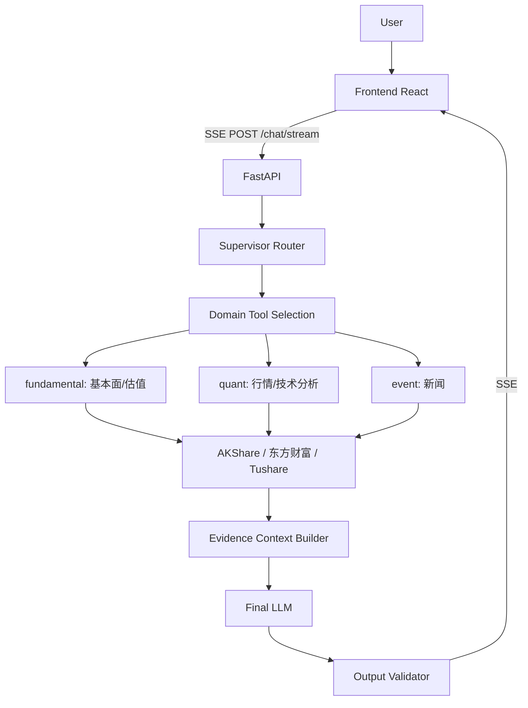

# AI Financial Agent

面向 A 股的、证据可追溯且默认不提供买卖/仓位建议的 AI 投研助手。用户以自然语言提问，Agent 通过多轮工具调用获取实时行情、技术指标、基本面、估值与新闻数据，构建可追溯的证据上下文，由大语言模型生成结构化研报式回答，并经确定性校验器检查后输出。

> 系统用于金融信息分析与研究辅助，不构成投资建议。

## Overview

本项目是一个完整的全栈 AI Agent 应用：

- **后端**（FastAPI + Python）：Supervisor 路由 → 领域工具调用 → 证据上下文 → 最终回答生成 → 输出校验的完整流水线，支持 SSE 流式输出。
- **前端**（React + TypeScript + Vite + Tailwind）：聊天式交互界面，实时展示工具调用过程与流式回答。
- **部署**（Docker Compose + Nginx）：一键启动，Nginx 反向代理 API 与 SSE 流。

## Features

- **Supervisor Router**：将用户问题路由到正确的领域（基本面 / 量化 / 事件），限定当轮可调用的工具域，避免无关工具调用。
- **领域 Worker**：fundamental（基本面 + 估值）、quant（行情 + 技术分析）、event（新闻）三类轻量执行配置。
- **Tool Calling**：基于 DeepSeek 工具调用的多轮执行，最多 8 轮 / 20 次调用，自动处理工具错误。
- **Evidence Context Builder**：将各工具返回数据按领域聚合为证据上下文（含来源、数据时间、抓取时间），最终回答严格基于可验证数据。
- **Output Validator**：确定性规则校验（非 LLM 评判），强制 4 大章节结构、拦截买卖/仓位建议与确定性预测、核对证据链一致性、区分数据时效，违规时降级输出。
- **Runtime Protection**：请求预算（8 轮 / 20 次调用 / 120 秒）、超时与取消机制、客户端断连即停止推理。
- **Observability**：LLM Token 用量、工具调用轨迹（名称 / 耗时 / 是否成功）、单次运行快照记录。
- **SSE Streaming**：工具调用过程支持实时流式展示；最终分析文本在通过输出安全校验后再进行流式下发。
- **Docker Deployment**：后端 + 前端 + Nginx 一键编排，数据库与日志持久化挂载。

## Architecture

```
User
  │
  ▼
Frontend (React + Vite + Tailwind)
  │  POST /chat/stream (SSE) / /api/*
  ▼
Nginx (reverse proxy, SSE buffering off)
  │
  ▼
FastAPI (app/api/routes.py + app/api/stream.py)
  │
  ▼
Supervisor Router (意图路由 → 领域工具选择)
  │
  ├── fundamental → get_stock_fundamentals / get_valuation_analysis
  ├── quant      → get_stock_price / get_technical_analysis
  └── event      → get_stock_news
  │
  ▼
Tools → 数据源 (AKShare / 东方财富 / Tushare)
  │
  ▼
Evidence Context Builder (LLM 无关的证据聚合)
  │
  ▼
Final LLM 生成回答 (deepseek-v4-pro)
  │
  ▼
Output Validator (确定性校验，违规则降级)
  │
  ▼
SSE events → Frontend
```



## Tech Stack

| 层 | 技术 |
|---|---|
| 后端 | Python 3.12, FastAPI, Uvicorn, OpenAI SDK（DeepSeek API）, SQLite（WAL） |
| 数据 | AKShare, Tushare, 东方财富公开接口 |
| 前端 | React 19, TypeScript, Vite 7, Tailwind CSS 4, react-markdown |
| 部署 | Docker, Docker Compose, Nginx |

## Core Engineering Design

**Supervisor Router 为什么存在**：股票问题涉及多个领域（基本面、量化、事件）。Router 先用轻量 LLM 调用把问题路由到单一领域，再将工具 schema 限定为该领域子集，降低误调用无关工具的概率、减少 token 消耗，也提升了回答一致性。

**Evidence Context 解决什么问题**：工具调用返回的数据分散且格式各异。Evidence Context 以不依赖 LLM 的方式按领域聚合（基本面 / 量化 / 事件），并保留每条数据的来源、数据时间与抓取时间，使最终回答可追溯到具体数据点，杜绝凭空编造数字。

**Output Validator 作为安全边界**：LLM 输出天然存在编造与过度承诺的风险。Validator 以确定性正则规则强制回答包含 4 大章节（市场概况与时效、技术面量化、基本面概况、综合态势与风险提示），拦截买卖/仓位等投资建议与确定性未来预测，核对回答数字与工具证据是否一致，识别缺失数据是否如实声明、数据时效是否区分。校验不通过时输出降级回答而非原始输出。

**Runtime Protection**：每次运行受 `RuntimeLimits` 约束（8 轮工具循环、20 次工具调用、120 秒总预算）；客户端断连通过 `CancelledError` 与生产者线程 stop 事件立即停止 LLM 推理与后续工具调用，不浪费 token。

**Observability 记录什么**：每次运行记录 LLM Token 用量（prompt / completion / total）、工具调用轨迹（名称、耗时、成功与否）、运行状态（正常 / 超时 / 达到上限 / 取消），供评测与问题排查使用。

## Data Sources

| 数据 | 来源 |
|---|---|
| 实时行情 | AKShare（东方财富接口） |
| 技术指标 | AKShare（基于行情计算） |
| 基本面数据 | Tushare（需 `TUSHARE_TOKEN`）、AKShare |
| 估值分析 | 基于行情与基本面计算 |
| 新闻资讯 | AKShare / 东方财富 |

数据均来自公开接口，依赖其可用性与时效性；抓取失败时 Agent 会在回答中如实声明缺失，不会编造。

## Quick Start

### 方式一：本地运行（开发）

```bash
# 1. 后端（Python 3.12）
python -m venv .venv
# Windows: .venv\Scripts\activate     Linux/macOS: source .venv/bin/activate
pip install -r requirements.txt
cp .env.example .env      # 编辑 .env，填入 DEEPSEEK_API_KEY

uvicorn app.api.routes:app --reload   # http://127.0.0.1:8000
```

```bash
# 2. 前端（另一终端）
cd frontend
npm ci
npm run dev               # http://127.0.0.1:5173（开发代理转发到 8000）
```

### 方式二：Docker Compose

```bash
cp .env.example .env      # 填入 DEEPSEEK_API_KEY
docker compose up --build # http://localhost（前端 80 端口）
```

## Environment Variables

模板见 `.env.example`（`.env` 已被 gitignore，不会进入版本库）。

| 变量 | 必填 | 默认值 | 说明 |
|---|---|---|---|
| `DEEPSEEK_API_KEY` | 是 | — | DeepSeek API 密钥（LLM 调用） |
| `TUSHARE_TOKEN` | 否 | — | Tushare token（基本面数据） |
| `LOG_LEVEL` | 否 | `INFO` | 日志级别 |
| `LOG_DIR` | 否 | `logs` | 日志目录 |
| `AGENT_DB_PATH` | 否 | `app/store/agent_runs.db` | SQLite 会话/运行记录路径 |
| `UVICORN_WORKERS` | 否 | `2` | Uvicorn worker 数（Docker 环境） |

## API

服务启动后 FastAPI 自动文档位于 `/docs`。

| Method | Path | 说明 |
|---|---|---|
| GET | `/health` | 健康检查 |
| POST | `/chat` | 完整 Agent 运行（非流式），`{question, session_id?}` → `{answer, tool_calls[], tool_rounds, max_rounds_reached, error?, run_id?, session_id?}` |
| GET | `/sessions` | 会话列表 |
| GET | `/sessions/{session_id}/runs` | 某会话的运行历史 |
| POST | `/chat/stream` | SSE 流式对话，`{message, session_id?}`，Content-Type `text/event-stream` |

SSE 事件协议（`event: <type>\ndata: <json>\n\n`）：

| 事件 | data | 说明 |
|---|---|---|
| `tool_call` | `{tool, args}` | 工具调用开始 |
| `tool_result` | `{tool, status: "ok"\|"error"}` | 工具调用结束 |
| `token` | `{content}` | 最终回答增量（仅通过校验后输出） |
| `degraded` | `{message, violations}` | 回答被校验器拦截，输出降级回答 |
| `done` | `{session_id, run_id}` | 本次运行结束（HTTP 恒为 200） |
| `error` | `{message}` | 错误事件 |

## Testing

```bash
python -m pytest -q
```

当前结果：**291 passed / 0 failed / 0 errors**。完整套件约 6.5 分钟，包含真实数据源相关测试。

注意：`requirements.txt` 未包含 `pytest`，全新环境需额外安装（`pip install pytest`）。

## Project Structure

```
├── app/
│   ├── agent/            # 编排核心：orchestrator / router / workers / evidence / runtime / observability
│   ├── api/              # FastAPI 路由与 SSE 流式端点
│   ├── data/             # 数据客户端（tushare 等）
│   ├── evaluation/       # 评测框架与用例
│   ├── fundamentals/     # 基本面分析
│   ├── news/             # 新闻分析
│   ├── output_quality/   # 输出校验器
│   ├── store/            # SQLite 持久化
│   ├── config.py         # 配置与 .env 加载
│   └── logging_conf.py   # 日志配置
├── frontend/
│   └── src/              # React 前端（api client / components）
├── tests/                # 291 项测试 + fixtures
├── tools/                # 后端工具（stock_tool / market_data 等）
├── scripts/              # 评测脚本
├── docs/                 # 审计文档
├── Dockerfile            # 后端镜像
├── Dockerfile.frontend   # 前端镜像（多阶段构建 + Nginx）
├── docker-compose.yml    # 一键编排
├── nginx.conf            # Nginx 站点配置（静态 + API 代理 + SSE）
├── main.py               # CLI 壳层
├── requirements.txt      # Python 依赖
└── .env.example          # 环境变量模板
```

## Security

- **密钥管理**：所有密钥通过环境变量注入（`.env` 已 gitignore，Docker 镜像不包含 `.env` 与 `*.db`）。
- **输出安全边界**：Output Validator 拦截投资建议与确定性预测（见 Core Engineering Design）。
- **运行保护**：请求预算、超时、取消；客户端断连即停止后端推理。
- **部署安全**：本仓库的 `docker-compose.yml` 默认**不含认证与 HTTPS**（`listen 80`），仅适合可信内网。**公网 Demo 正式上线时必须使用 HTTPS/TLS**（Nginx HTTPS 就绪模板见 `nginx.conf`，默认关闭、不生成假证书），并补充认证（OIDC / API Token / 网关）、速率限制、关闭 `/docs`、非 root 运行容器等（详见 `docs/deployment/deployment_audit.md`）。

## Limitations

- 数据依赖外部公开接口（AKShare / 东方财富 / Tushare），存在不可用、限流与延迟。
- LLM 输出具有不确定性，虽经确定性校验器检查，仍可能出现降级回答。
- 系统**不提供**买卖建议、仓位建议或任何确定性投资预测；仅供信息分析与研究辅助。
- SQLite 为单文件数据库，高并发场景下需评估（多 worker 并行写可能 `database is locked`）。
- 公网部署需要额外的安全配置（认证 / HTTPS / 速率限制）。

## Evaluation

- 自动化测试：291 项（`tests/`），覆盖路由、编排、证据构建、校验器、运行时、SSE 等。
- 评测脚本：`scripts/eval_phase20.py`（基于 `app/evaluation/` 的评测框架）。
- 评测报告：
  - [Phase 20 Evaluation Report](./docs/evaluation/eval_report_phase20.md)
  - [Phase 22 Benchmark Results](./docs/evaluation/phase22_benchmark_results.json)
- 评测运行产物见 `app/evaluation/reports/`（该目录已 gitignore）。

## Deployment

- 部署架构与安全基线见 [Deployment Audit](./docs/deployment/deployment_audit.md)。

## License

MIT License。详见 [LICENSE](./LICENSE)。
